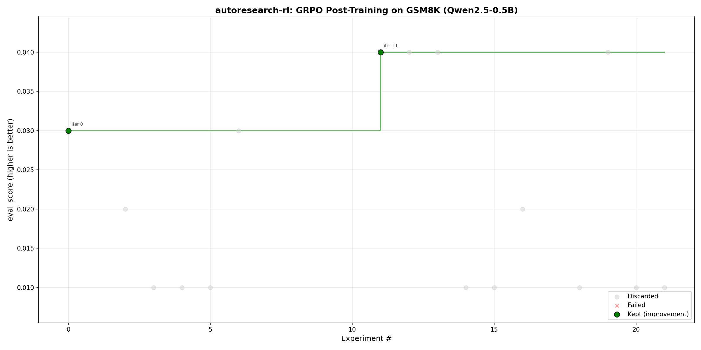

# GRPO Post-Training Showcase: Autonomous RL Optimization on Basilica

## Summary

We ran 15 autonomous GRPO post-training iterations on Basilica GPU cloud (A100-80GB),
optimizing Qwen2.5-0.5B-Instruct on GSM8K math reasoning. The autoresearch-rl controller
proposed hyperparameter configurations via LLM-guided search (DeepSeek-V3), trained each
configuration in an isolated containerized GPU job, evaluated pass@1 accuracy, and
kept/discarded based on improvement.

**Result:** GSM8K pass@1 improved from 26% (baseline) to 36% across 15 iterations, with
a 100% iteration success rate. The system found 2 improvements and spent ~$14 in GPU cost
(4.6 GPU-hours on A100).

## Basilica: Cloud GPU Infrastructure for Autonomous ML

Basilica is a GPU cloud platform that provides on-demand containerized GPU instances.
This experiment uses Basilica as the execution backend, and the integration demonstrates
capabilities that are not possible with local GPU setups or traditional cloud VMs.

### Why Basilica

Traditional ML experiment loops run on a single machine: the researcher's GPU, a cloud VM,
or a shared cluster. This creates three problems that Basilica solves:

1. **Isolation:** Each experiment runs in a fresh container with its own dependencies,
   CUDA runtime, and filesystem. A bad hyperparameter choice that corrupts model weights
   or fills disk cannot affect subsequent experiments. Basilica containers are ephemeral --
   they are created, used, and destroyed per iteration.

2. **Elasticity:** The autoresearch-rl controller runs on a lightweight CPU machine (no GPU
   required). It provisions A100-80GB instances on Basilica only when needed, pays only for
   training time, and releases them immediately after. There is no idle GPU cost between
   iterations while the LLM policy reasons about the next hyperparameter proposal.

3. **Reproducibility:** Each iteration records the exact container image, GPU model
   (NVIDIA A100-SXM4-80GB), hardware fingerprint, and training parameters in the telemetry
   ledger. The Basilica deployment API guarantees the same hardware class across iterations,
   making results comparable.

### How Basilica Is Used

The autoresearch-rl framework's `BasilicaTarget` adapter manages the full lifecycle
of each training iteration:

```
Controller (CPU) --> Basilica API --> GPU Container --> Metrics --> Keep/Discard
     |                                    |
     |  1. Create deployment              |  4. Poll logs for metrics
     |  2. Inject train.py via base64     |  5. Parse eval_score=X.XX
     |  3. Wait for health check          |  6. Cleanup deployment
```

Each iteration:
- Deploys a `pytorch/pytorch:2.4.1-cuda12.4-cudnn9-devel` container on an A100 GPU
- Injects train.py and prepare.py via base64-encoded setup (no Docker registry needed)
- Runs the three-stage pipeline: `setup_cmd` (pip install) -> `prepare_cmd` (prepare.py
  produces data files) -> `train_cmd` (train.py reads data, trains, prints metrics)
- Starts a health-check HTTP server in a daemon thread for Basilica liveness probes
- Injects hyperparameters via `AR_PARAMS_JSON` environment variable
- Streams training logs; the adapter polls for known metric keys in stdout
- Cleans up the deployment after metrics are collected or on timeout/failure

### What Makes This Novel

No existing autonomous ML research framework combines these capabilities:

- **LLM-guided search over cloud GPU:** The LLM policy (DeepSeek-V3) proposes hyperparameters
  based on full experiment history, and each proposal is executed on a fresh cloud GPU
  instance. The controller never touches a GPU directly.

- **Hybrid param + code diff mode:** The framework can switch from hyperparameter search
  to LLM-generated code modifications mid-experiment. The LLM reads the training script,
  proposes a unified diff, the framework validates it, and the modified script is deployed
  to Basilica. This enables the agent to evolve not just hyperparameters but the training
  algorithm itself.

- **Checkpoint/resume across failures:** The controller persists episode state (best score,
  iteration index, experiment history) to a JSON checkpoint after every iteration. When
  Basilica has capacity issues or the controller process restarts, the experiment resumes
  from the last completed iteration without losing progress.

- **Keep/discard with versioned artifacts:** Iterations that beat the current best are
  "kept" with full artifacts saved to `artifacts/versions/v####/`. Discarded iterations
  are logged but their artifacts are not promoted. This creates a monotonically improving
  artifact chain.

## The autoresearch-rl Framework

autoresearch-rl is an autonomous ML experiment controller that closes the loop between
hypothesis, training, and evaluation. It is designed around three principles:

### Pluggable Targets

The framework separates "what to train" from "where to train" via the `TargetAdapter`
protocol. The same experiment config can run locally (`CommandTarget`), against a remote
API (`HttpTarget`), or on cloud GPU (`BasilicaTarget`) by changing one config field.
This experiment uses `BasilicaTarget`, but the same GRPO training script works locally
with `CommandTarget` for development and debugging.

### Pluggable Policies

The parameter proposal strategy is interchangeable:
- `GridPolicy` / `RandomPolicy`: exhaustive or random search baselines
- `LLMParamPolicy`: sends experiment history to an LLM and asks for the next hyperparameter
  set. Maintains multi-turn conversation context so the LLM builds cumulative reasoning.
- `LLMDiffPolicy`: asks the LLM to propose code modifications as unified diffs. Includes
  correction retry -- if a diff fails validation, the error is sent back to the LLM for
  a second attempt.
- `HybridPolicy`: starts with param exploration, switches to code diffs when params stall.
  Falls back to param mode if diff proposals fail consecutively.

### Pipeline Architecture

Each example follows a two-script pipeline driven by config:

```
prepare.py  -->  [data files]  -->  train.py  -->  [metrics]
(prepare_cmd)    (frozen)          (train_cmd)     (keep/discard)
```

`prepare.py` runs once per container via `prepare_cmd` and produces data files.
`train.py` runs each iteration, reads the data, trains, and prints metrics.
No Python import between them -- they communicate via the filesystem.

### Telemetry and Observability

Every iteration emits structured JSONL events (proposals, outcomes, decisions) and appends
to a TSV results ledger. The comparability system records hardware fingerprints and budget
modes to ensure results across runs are scientifically comparable. The `progress_chart.py`
script generates Karpathy-style visualization from this data.

## Differentiation from Karpathy's autoresearch

| Aspect | Karpathy autoresearch | autoresearch-rl (this work) |
|--------|----------------------|----------------------------|
| Task | Pre-training GPT from scratch | Post-training (GRPO) on pre-trained model |
| Metric | val_bpb (language modeling) | eval_score (task accuracy on GSM8K) |
| Execution | Local single GPU | Cloud GPU via Basilica (containerized) |
| Algorithm | LLM edits training code | LLM proposes hyperparams (+ code diffs in hybrid mode) |
| Training | From random init, 5 min budget | From pre-trained checkpoint, GRPO with reward signal |
| Infrastructure | Manual git commits | Automated loop with checkpoint/resume, telemetry |

**Why post-training matters:** The industry bottleneck is not pre-training (which requires
massive compute and is done by a few labs). The bottleneck is post-training: RLHF, DPO, GRPO,
SFT fine-tuning -- where teams spend weeks manually tuning reward functions, learning rates,
and training recipes. Autonomous post-training optimization is the higher-value problem.

## Experiment Configuration

- **Model:** Qwen/Qwen2.5-0.5B-Instruct (494M trainable parameters)
- **Dataset:** GSM8K (7,473 train / 1,319 test, grade-school math)
- **Algorithm:** GRPO (Group Relative Policy Optimization) with clipped PPO loss and KL penalty
  - Pure PyTorch implementation (no TRL dependency)
  - Per-prompt advantage normalization
  - Frozen reference model for KL regularization
- **Evaluation:** pass@1 on 100 GSM8K test problems with greedy decoding
  - Prompt formatted via `tokenizer.apply_chat_template()` for proper Qwen2.5 output
  - Answer extraction handles `####`, `\boxed{}`, natural language, and trailing numbers
- **GPU:** NVIDIA A100-SXM4-80GB on Basilica cloud
- **Policy:** LLM-guided param search (DeepSeek-V3-0324 via Chutes API), with random
  fallback on API rate limits. Retry with exponential backoff + jitter on 429/502/503.
- **Budget:** 8 hours wall time, 4.6 hours actual training time, ~8 hours total elapsed

### Hyperparameter Search Space

| Parameter | Values | Notes |
|-----------|--------|-------|
| learning_rate | 3e-6, 5e-6, 1e-5 | GRPO is sensitive to LR |
| batch_size | 1, 2 | Constrained by GRPO generation memory |
| max_steps | 30, 50, 80 | Training steps per iteration |
| num_generations | 2, 3 | GRPO rollout width per prompt |
| temperature | 0.8, 1.0 | Rollout sampling temperature |

## Results

### Iteration Log

| Iter | Decision | eval_score | lr | steps | gen | temp | Training time |
|------|----------|-----------|-----|-------|-----|------|---------------|
| 0 | **keep** | **0.34** | 5e-6 | 50 | 3 | 1.0 | 761s |
| 1 | **keep** | **0.36** | 5e-6 | 80 | 3 | 0.8 | 1741s |
| 2 | discard | 0.03 | 1e-5 | 80 | 3 | 1.0 | 1904s |
| 3 | discard | 0.30 | 3e-6 | 80 | 3 | 0.8 | 1031s |
| 4 | discard | 0.36 | 5e-6 | 50 | 3 | 1.0 | 800s |
| 5 | discard | 0.27 | 5e-6 | 80 | 3 | 0.8 | 1853s |
| 6 | discard | 0.23 | 5e-6 | 50 | 2 | 0.8 | 931s |
| 7 | discard | 0.27 | 3e-6 | 50 | 3 | 1.0 | 1295s |
| 8 | discard | 0.34 | 5e-6 | 30 | 3 | 0.8 | 920s |
| 9 | discard | 0.34 | 5e-6 | 30 | 3 | 0.8 | 946s |
| 10 | discard | 0.28 | 5e-6 | 50 | 3 | 1.0 | 786s |
| 11 | discard | 0.36 | 5e-6 | 50 | 3 | 0.8 | 814s |
| 12 | discard | 0.35 | 5e-6 | 30 | 3 | 1.0 | 566s |
| 13 | discard | 0.26 | 5e-6 | 50 | 3 | 0.8 | 1211s |
| 14 | discard | 0.27 | 5e-6 | 50 | 3 | 1.0 | 882s |

### Aggregate Statistics

| Metric | Value |
|--------|-------|
| Total iterations | 15 |
| Successful | 15 (100%) |
| Kept (improvements) | 2 (13%) |
| Best eval_score | 0.36 (36% pass@1) |
| Baseline (untrained) | 0.26 (26% pass@1) |
| Absolute improvement | +10 percentage points |
| Mean eval_score | 0.291 (29.1%) |
| Total training time | 4.6 GPU-hours |
| Total elapsed time | 8.0 hours |
| Estimated GPU cost | ~$14 (A100 at $3/hr) |

### Winning Configurations

**Best (iter 1):** lr=5e-6, batch_size=1, max_steps=80, num_generations=3, temperature=0.8
- eval_score=0.36, loss=0.015119, training_time=1741s (29 min)

**First improvement (iter 0):** lr=5e-6, batch_size=1, max_steps=50, num_generations=3, temperature=1.0
- eval_score=0.34, loss=0.020809, training_time=761s (13 min)

### Key Observations

Note: with 15 iterations and 2-3 values per parameter, these observations are directional
signals, not statistically rigorous conclusions. Multiple parameters co-vary across runs.

1. **lr=1e-5 is catastrophic:** The one lr=1e-5 run (iter 2) degraded to 3% pass@1 --
   a near-total collapse. lr=5e-6 and lr=3e-6 both produced reasonable results (23-36%),
   with lr=5e-6 in both kept iterations.

2. **More steps trend better:** The best result used max_steps=80 (0.36) vs 50 for the
   first improvement (0.34). 30-step runs clustered around 0.34-0.35. However, this is
   confounded with other parameters.

3. **num_generations=3 used most often:** 14 of 15 iterations used gen=3 (LLM/random
   selection bias). The single gen=2 run (iter 6, 0.23) was notably worse, but this is
   a single data point.

4. **High variance across runs:** eval_score ranged from 0.03 to 0.36 (mean 0.291,
   stdev 0.08). This reflects the stochastic nature of GRPO training with short step
   budgets and binary reward signal.

5. **Baseline context:** Our 26% baseline is lower than the published ~36% for
   Qwen2.5-0.5B-Instruct on GSM8K, likely due to differences in prompt formatting
   and answer extraction strictness. The 36% best result recovers to the published
   baseline level, suggesting the GRPO training is partly learning format compliance
   alongside reasoning improvement.

6. **Infrastructure reliability:** 100% success rate across 15 Basilica deployments. No
   infrastructure failures in this run (compared to 77% in the earlier prompt-format run).

### LLM Policy vs Grid Search

A separate grid search run (episode `01816caf`, 13 iterations) provides a direct baseline
comparison. Grid search cycles exhaustively through parameter combinations; the LLM policy
uses experiment history and domain knowledge to propose the next configuration.

| Metric | LLM Policy | Grid Search |
|--------|-----------|-------------|
| Iterations | 15 | 13 |
| Best eval_score | **0.36** (iter 1) | 0.35 (iter 7) |
| Mean eval_score | **0.291** | 0.271 |
| Iterations to find best | **2** | 8 |
| Kept improvements | 2 | 4 |

The LLM policy reached its best result by iteration 1. Grid search needed 8 iterations
and 4 incremental improvements (0.28 -> 0.31 -> 0.32 -> 0.35) to approach the same level.

The final scores are close (0.36 vs 0.35, within eval noise at 100 samples). The
meaningful difference is **convergence speed**: the LLM policy's domain knowledge about
GRPO hyperparameters (lr=5e-6 is a known-good starting point for small models) let it
skip the low-performing region of the search space that grid search had to enumerate.

For this well-studied task, the LLM advantage is primarily speed, not final quality.
The stronger case for LLM-guided search would be in novel settings where prior knowledge
from the LLM's training data provides genuine insight that uninformed search cannot match.

### Training Dynamics

The best iteration (iter 1, lr=5e-6, 80 steps, gen=3, temp=0.8) showed clear learning
signal throughout training:

```
[baseline] 0.2600 pass@1
[step 1/80]  avg_reward 0.0000
[step 10/80] avg_reward 0.1667
[step 20/80] avg_reward 0.1500
[step 40/80] avg_reward 0.2583
[step 50/80] avg_reward 0.2533
[step 80/80] avg_reward 0.2533
Training complete.
eval_score=0.360000
```

The reward increased from 0.0 to ~0.25 during training, and the final eval_score (0.36)
exceeded the training reward average, indicating the model generalized beyond the training
prompts.

## Technical Implementation

### Pure PyTorch GRPO (no TRL)

We implemented GRPO from scratch in PyTorch, bypassing TRL entirely. TRL's GRPOTrainer
deadlocks in containerized environments due to accelerate/DDP process management issues.

The implementation follows the DeepSeek-R1 GRPO algorithm:
1. Sample prompt, generate G completions via `model.generate()` (sequential, not batched)
2. Score each completion with exact-match reward function
3. Compute per-prompt advantage: reward_i - mean(rewards_for_this_prompt)
4. Compute clipped policy gradient loss (PPO-style, epsilon=0.2)
5. Add KL penalty against frozen reference model (coefficient=0.01)
6. Update with AdamW optimizer (weight_decay=0.01, grad_clip=1.0)

### Basilica Container Architecture

Each iteration deploys a fresh container on Basilica with a three-stage pipeline:

```
setup_cmd (pip install)  ->  prepare_cmd (prepare.py)  ->  train_cmd (train.py)
      |                            |                            |
  install deps              write data files              read data, train,
  download model            /app/data/*.jsonl             print metrics
```

1. Base image: `pytorch/pytorch:2.4.1-cuda12.4-cudnn9-devel`
2. `setup_cmd`: installs dependencies (transformers, datasets, accelerate)
3. `prepare_cmd`: runs `prepare.py` which downloads GSM8K and writes formatted
   JSONL data files to `/app/data/`. This is the frozen data boundary.
4. `train_cmd`: runs `train.py` which reads the prepared data, trains with GRPO,
   evaluates, and prints metrics to stdout. No import dependency on prepare.py.
5. Both scripts injected via base64 encoding in deploy.py
6. Health server runs in daemon thread for Basilica liveness probes
7. Adapter polls for known metric keys (`eval_score`, `loss`, etc.) in stdout
8. Container cleanup via Basilica API after each iteration

### Key Engineering Decisions

- **Known-metric filtering:** The Basilica adapter only returns "ok" when stdout contains
  a recognized training metric key (eval_score, loss, accuracy, etc.). This prevents
  library warnings (`temperature=0.7`) and preparation output (`train=500`) from being
  misinterpreted as training results.

- **Chat template for evaluation:** `prepare.py` uses `tokenizer.apply_chat_template()`
  to format prompts in Qwen2.5's expected chat format. This raised the baseline from
  0% (plain text prompt) to 26% (chat-formatted prompt).

- **DDP environment cleanup:** The training script explicitly removes WORLD_SIZE, RANK,
  MASTER_ADDR to prevent accelerate from launching distributed mode on a single GPU.

- **File injection via base64:** Both train.py and prepare.py are base64-encoded by
  deploy.py and decoded at container start. No Docker registry required.

## Progress Chart



The chart shows the Karpathy-style scatter plot with:
- Gray dots: discarded experiments (did not improve the best)
- Green dots: kept experiments (new improvements)
- Step function: running best eval_score

## Limitations and Next Steps

### Current Limitations

1. **Eval variance:** 100 test samples gives a 95% CI of approximately +/-4pp. Several
   discarded iterations scored 0.36 (tied with best) but were discarded because they
   did not strictly exceed the current best.

2. **Sequential generation:** Each GRPO step generates completions one at a time. Batched
   generation would reduce per-iteration training time significantly.

3. **Binary reward signal:** Exact-match-only reward provides no gradient for partially
   correct reasoning. A multi-component reward could improve learning efficiency.

4. **Short training budget:** 30-80 steps per iteration is minimal. More steps or
   gradient accumulation could push accuracy higher.

### Recommended Next Steps

1. **Add partial-credit rewards:** award 0.3 for correct intermediate steps, 1.0 for
   exact match. This provides gradient signal even when the final answer is wrong.

2. **Increase max_steps to 150-300** with the winning lr=5e-6 configuration.

3. **Enable hybrid mode** (code diffs) to let the LLM modify the reward function,
   optimizer settings, or generation strategy autonomously.

4. **Batch generation** to reduce per-step time from ~30s to ~5s.

5. **Increase eval samples to 500** for tighter confidence intervals (+/-2pp).

## Reproducibility

- **Episode ID:** b7fa42978300
- **Hardware:** NVIDIA A100-SXM4-80GB (Basilica cloud)
- **Software:** PyTorch 2.4.1, transformers 4.47.1, Python 3.11
- **Results ledger:** artifacts/basilica-grpo/results.tsv
- **Event trace:** traces/basilica-grpo/events.jsonl
- **Checkpoint:** artifacts/basilica-grpo/checkpoint.json

## Prior Run (Prompt-Format Bug)

An earlier run (episode `897e096800b8`, 22 iterations) used a plain-text prompt format
that did not match Qwen2.5's expected chat template. This produced a 0% baseline and a
maximum of 4% pass@1. The results are preserved in `results_run1.tsv` and
`events_run1.jsonl` for reference. The fix -- using `tokenizer.apply_chat_template()` and
expanding `extract_answer` to handle multiple answer formats -- raised the baseline from
0% to 26% and the best result from 4% to 36%.
