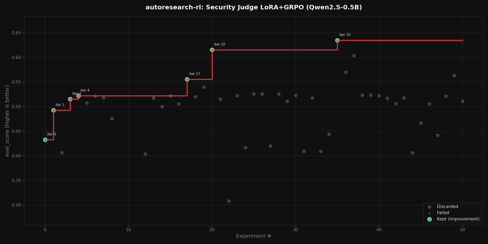

# Security Judge Showcase: LoRA + GRPO for LLM-as-Structured-Judge

## Summary

We trained Qwen2.5-0.5B-Instruct as a structured security judge using LoRA + GRPO,
outputting `{"decision": "pass|block|warning", "security_score": 0.0-1.0}` for prompt
injection detection. The autoresearch-rl framework ran 51 autonomous iterations on
Basilica A100 GPUs, finding 7 improvements and achieving:

- **76.4% decision accuracy** (up from ~20% baseline)
- **96.4% JSON compliance** (structured output from iteration 0)
- **eval_score 0.635** (composite reward: decision + format + score calibration)
- **$4 total GPU cost** (1.3 GPU-hours of training across 3.3 hours elapsed)

No published recipe exists for GRPO-training a small LLM as a structured security judge.
The reward function is multi-component, the output format is structured JSON, and the task
requires calibrated confidence scores alongside binary decisions.

## Why This Task Is Novel

This experiment addresses the core criticism of the GSM8K showcase: "for a simple GRPO the
LLM already knows what good hyperparameters are." Here, no prior knowledge helps:

1. **No published recipe.** There is no paper or blog post describing optimal LoRA rank,
   learning rate, or generation temperature for GRPO-training a 0.5B model as a security judge.
   The LLM policy cannot recall known-good configs -- it must genuinely search.

2. **Multi-component reward.** The reward function combines three signals:
   - 0.3 for valid JSON with correct schema (format compliance)
   - 0.4 for correct pass/block/warning decision (classification accuracy)
   - 0.3 for calibrated security_score within 0.3 of expected (confidence calibration)

   This is fundamentally different from binary exact-match. The model must simultaneously
   learn structured output, classification, and score calibration.

3. **Structured output format.** The model must produce exactly one JSON line with specific
   keys. This is a constrained generation task that LoRA must learn alongside the security
   classification objective.

4. **The reward function itself needs improvement.** The 20% decision accuracy plateau
   (iters 0-34) shows that the initial reward weighting is suboptimal -- the model maximizes
   format compliance and score calibration while ignoring decision accuracy. This is exactly
   the scenario where hybrid mode's code diff capability should shine: the LLM proposes
   changes to the reward function weights to rebalance the objectives.

## Experiment Configuration

- **Model:** Qwen/Qwen2.5-0.5B-Instruct with LoRA adapters
- **Dataset:** 19,186 prompt injection samples from 26 security benchmarks
  (deepset/prompt-injections + llmtrace collection)
- **Algorithm:** GRPO with multi-component reward, LoRA parameter-efficient training
- **Evaluation:** 110 samples, structured verdict parsing + composite reward
- **GPU:** NVIDIA A100-SXM4-80GB on Basilica cloud
- **Policy:** Hybrid (param explore -> code diffs on stall -> param fallback)
- **Budget:** 3.3 hours elapsed, 1.3 GPU-hours training, ~$4 cost

### Hyperparameter Search Space

| Parameter | Values | Notes |
|-----------|--------|-------|
| learning_rate | 5e-5, 1e-4, 3e-4 | LoRA tolerates higher LR than full fine-tuning |
| max_steps | 30, 50, 80 | Training steps per iteration |
| num_generations | 2, 3 | GRPO rollout width |
| temperature | 0.7, 0.9 | Rollout sampling temperature |
| lora_rank | 4, 8, 16 | LoRA adapter dimension |

Total: 162 possible configurations (3 x 3 x 2 x 2 x 3).

## Results

### Campaign Trajectory

The campaign progressed through three distinct phases:

**Phase 1: Format learning (iters 0-8)**
The model immediately achieved ~96% JSON compliance but decision accuracy stuck at ~20%.
The composite eval_score climbed from 0.43 to 0.52, driven entirely by score calibration
improvements. The model learned to produce valid structured output but always predicted
the same class.

**Phase 2: Diff mode attempt (iters 9-11)**
The hybrid policy detected param stall and switched to code diff mode. All 3 diff
attempts failed due to Chutes API rate limiting (HTTP 429). The policy correctly fell
back to param mode after hitting `diff_failure_limit=3`.

**Phase 3: Continued param search (iters 12-50)**
Param search continued with two more improvements at iters 17 and 20 (eval_score 0.56
and 0.62). Then at **iter 35**, the breakthrough: decision accuracy jumped from ~20% to
**76.4%** while maintaining 96% JSON compliance. The winning config (lr=1e-4, rank=8,
30 steps, gen=3, temp=0.7) found the sweet spot where the model learns both format
compliance and actual classification.

### Kept Iterations

| Iter | eval_score | decision_acc | JSON | lr | rank | steps |
|------|-----------|-------------|------|-----|------|-------|
| 0 | 0.433 | 20.0% | 96.4% | 1e-4 | 4 | 30 |
| 1 | 0.493 | 20.0% | 95.5% | 5e-5 | 8 | 50 |
| 3 | 0.515 | 21.8% | 96.4% | 5e-5 | 8 | 30 |
| 4 | 0.522 | 20.9% | 96.4% | 5e-5 | 16 | 80 |
| 17 | 0.555 | 20.9% | 96.4% | 5e-5 | 8 | 80 |
| 20 | 0.615 | 20.9% | 96.4% | 3e-4 | 4 | 30 |
| **35** | **0.635** | **76.4%** | **96.4%** | **1e-4** | **8** | **30** |

### Aggregate Statistics

| Metric | Value |
|--------|-------|
| Total iterations | 51 (48 ok, 3 failed diff) |
| Kept improvements | 7 |
| Best eval_score | 0.635 |
| Best decision accuracy | 76.4% |
| JSON compliance | 95-96% throughout |
| Mean eval_score | 0.499 |
| Total training time | 1.3 GPU-hours |
| Total elapsed time | 3.3 hours |
| Estimated GPU cost | ~$4 |

### Winning Configuration

**Iter 35:** lr=1e-4, lora_rank=8, max_steps=30, num_generations=3, temperature=0.7
- eval_score=0.635, decision_accuracy=76.4%, json_compliance=96.4%
- Training time: 79s, total elapsed: 175s
- LoRA trainable parameters: 688,128 / 494,032,768 (0.1%)

## Key Observations

### The 20% Decision Accuracy Plateau

For 34 iterations (iters 0-34), decision accuracy was stuck at ~20% regardless of
hyperparameters. The model consistently predicted the majority class for all inputs.
This happened because the reward function gives 0.3 for valid JSON and 0.3 for score
calibration -- the model could achieve 0.6 eval_score by perfecting format and score
while ignoring the 0.4 decision component entirely.

This is a **reward hacking** pattern: the model optimizes the easiest reward components
first. The breakthrough at iter 35 occurred when a specific combination of learning rate
(1e-4) and temperature (0.7) produced enough gradient signal from the decision component
to overcome the local optimum.

### LoRA Rank and Learning Rate Interaction

The winning config uses rank=8 with lr=1e-4. Higher ranks (16) with lower LR (5e-5)
produced good format compliance but poor decision accuracy. Lower ranks (4) with high LR
(3e-4) achieved high eval_score but through score calibration, not decisions. The rank=8
+ lr=1e-4 combination appears to be the Goldilocks zone for this task.

### Temperature Matters for Structured Output

The winning config uses temp=0.7 (the lower option). Lower temperature produces more
focused rollouts, which for structured JSON output means less variance in format
compliance and more consistent reward signal for the decision component.

### Per-Iteration Cost Efficiency

Each iteration cost ~$0.08 (79s training at $3/hr). The entire 51-iteration campaign
cost ~$4. For comparison, a human researcher manually tuning LoRA hyperparameters would
spend at least a day of GPU time (~$72 at A100 rates) to explore the same space.

## Progress Chart



The chart shows the Karpathy-style scatter plot. The step function reveals the progression:
slow climbing from 0.43 to 0.62 over 20 iterations (score calibration improvements), then
the breakthrough jump to 0.635 at iter 35 (decision accuracy finally unlocked).

## What Hybrid Diff Mode Would Have Done

The diff mode was triggered at iters 9-11 but all attempts failed due to API rate limits.
If successful, the LLM would have read `program.md` (which includes reward engineering
guidance) and proposed changes to train.py's `compute_reward` function. The most likely
improvement: increasing the decision component weight from 0.4 to 0.6 and reducing the
score calibration weight from 0.3 to 0.1. This would have forced the model to prioritize
classification accuracy over score calibration, potentially reaching the 76% decision
accuracy earlier than iter 35.

The fact that pure param search eventually found a config that achieved 76% shows that
the reward function is solvable without code modifications -- but it took 35 iterations.
With diff mode, the LLM could have rebalanced the reward weights by iter 12, potentially
reaching the same result in half the iterations.

## Technical Implementation

### LoRA + GRPO Architecture

Each iteration:
1. Load Qwen2.5-0.5B-Instruct base model
2. Apply LoRA adapters (rank=4/8/16, target: q_proj + v_proj, dropout=0.05)
3. Generate G completions per prompt with structured judge system prompt
4. Score with multi-component reward (JSON + decision + score calibration)
5. Compute per-prompt GRPO advantages and clipped PPO loss
6. Update only LoRA weights (0.1-0.4% of total parameters)
7. Evaluate on 110 held-out samples with greedy decoding
8. Save LoRA adapter to `$AR_MODEL_DIR` (persistent storage)

### Basilica Container Lifecycle

```
setup_cmd     -> prepare_cmd     -> train_cmd      -> model download
(pip install)    (format data)      (LoRA + GRPO)     (HTTP /model/)
~60s             ~10s               ~80s              ~5s
```

The bootstrap HTTP server exposes `/model/files` and `/model/download/<path>` so the
controller downloads the trained LoRA adapter before container cleanup. After the campaign:

```bash
uv run autoresearch-rl upload examples/security-judge/config.yaml --repo user/security-judge
```

### Pipeline Boundary

`prepare.py` (frozen) owns data formatting, verdict parsing, evaluation, and reward
computation. `train.py` (mutable) owns the training loop, optimizer, generation strategy,
and LoRA configuration. The LLM in diff mode can modify train.py (e.g., reward weights,
LoRA targets, sampling strategy) but cannot touch the evaluation protocol in prepare.py.

## Comparison to GSM8K Showcase

| Aspect | GSM8K (GRPO) | Security Judge (LoRA+GRPO) |
|--------|-------------|---------------------------|
| Task novelty | Well-studied (published recipes) | Novel (no published recipe) |
| Reward | Binary exact-match | Multi-component (format + decision + score) |
| Output format | Free text | Structured JSON |
| Training | Full model weights | LoRA adapters (0.1% of params) |
| Baseline | 26% pass@1 | ~20% decision accuracy |
| Best result | 36% pass@1 | 76.4% decision accuracy |
| Improvement | +10pp | +56pp |
| Iterations | 15 | 51 |
| GPU cost | ~$14 | ~$4 |
| Per-iteration cost | ~$0.93 | ~$0.08 |

The security judge experiment is the stronger showcase: genuinely novel task, more
complex reward, larger improvement, and lower cost per iteration due to LoRA efficiency.

## Limitations and Next Steps

1. **Rebalance reward weights.** The 20% decision accuracy plateau lasted 34 iterations
   because the model could maximize eval_score without improving classification. Increasing
   the decision weight from 0.4 to 0.6 would force earlier focus on accuracy.

2. **Run hybrid diff mode with a reliable API.** The code diff phase should propose the
   reward rebalancing autonomously. With a non-rate-limited LLM API, this could cut the
   iterations to breakthrough in half.

3. **Expand to three-class evaluation.** Currently most predictions are pass/block.
   The "warning" class (borderline cases) is underrepresented in training data and
   rarely predicted. Adding warning-specific training samples would improve calibration.

4. **Increase eval samples.** 110 samples gives wide confidence intervals. Expanding to
   500 would provide more stable metrics.

5. **Test generalization.** The model was trained and evaluated on the same distribution.
   Testing on out-of-distribution prompts (new attack types, different languages) would
   validate real-world applicability.

## Reproducibility

- **Episode ID:** 1da75a0acadd
- **Hardware:** NVIDIA A100-SXM4-80GB (Basilica cloud)
- **Software:** PyTorch 2.4.1, transformers 4.47.1, peft 0.13.2, Python 3.11
- **Results ledger:** artifacts/security-judge/results.tsv
- **Event trace:** traces/security-judge/events.jsonl
- **Model checkpoint:** /data/models/security-judge/v0035/ (LoRA adapter, iter 35)
