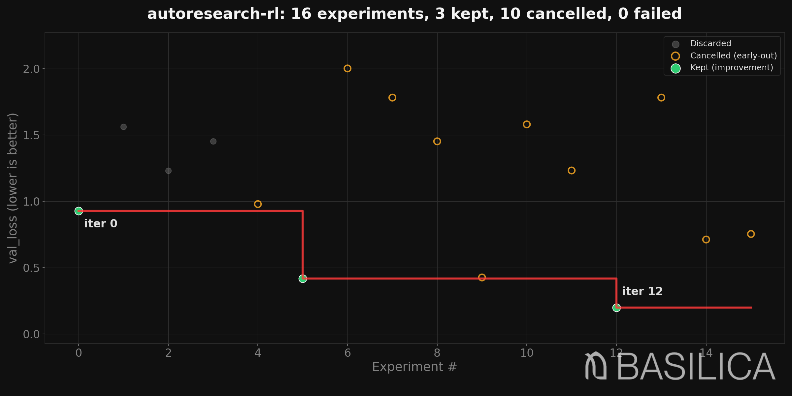

# Parallel + Cancel Showcase

A 13-second self-contained demo that you can run on your laptop. No GPU.
No API keys. No accounts.



## Why CPU?

The whole point is *anyone can run this immediately*, including reviewers,
auditors, and CI. The training step is a deterministic synthetic loss
curve — fast (~60 ms per step), cheap (zero dollars), reproducible.

Everything that needs a GPU in production lives in
[`examples/basilica-grpo/`](../basilica-grpo/) and
[`examples/deberta-prompt-injection/`](../deberta-prompt-injection/) —
those exercise the same control loop with a real model. This example
exists to demonstrate the *control loop itself*, end-to-end, in a
single command.

## What it does

A hyperparameter sweep over `learning_rate × batch_size` with:

- **16 trials, 4 running concurrently.** A thread pool admits trials
  against a tiny in-process resource bookkeeper; the controller picks
  the next 4 candidates whenever a slot frees up.
- **Live mid-trial cancellation.** Every trial calls
  `emit_progress(step=, step_target=, metrics=...)` per step. The
  controller watches that stream and runs each trial's metric trajectory
  through a power-law forecaster. When a trial *cannot beat the best
  result so far*, the controller writes a "please stop" file and the
  next `emit_progress(...)` call exits the trial cleanly with code 42.
  In a typical run, ~60 % of trials get cancelled this way and the
  campaign finishes ~2× faster than it would otherwise.
- **A timeline you can open in a browser.** The controller writes
  `traces/timeline.json` in Chrome's trace-event format. Drop it into
  `chrome://tracing` or [`ui.perfetto.dev`](https://ui.perfetto.dev) to
  see every iteration, every Basilica phase (when applicable), every
  LLM call as boxes on a timeline.
- **Refusal to start with a broken config.** Before the first trial
  runs, a runtime validator checks that your training script actually
  calls `emit_progress(...)` (otherwise the cancellation feature is
  silently dead). Eight other checks cover env vars, file existence,
  and writable paths.

## How to run

From the repo root:

```bash
bash examples/parallel-cancel-showcase/run.sh
```

or

```bash
make showcase
```

Output you should see:

```
== Running parallel + cancel showcase (max_concurrency=4) ==
{
  "iterations": 16,
  "best_value": 0.200222,
  "best_score": 0.200222
}

== Ledger summary ==
Total rows:       16
Status breakdown:
     10 cancelled
      3 discard
      3 keep

== Timeline events ==
  Total spans: 41
  executor.execute: 16
  policy.propose_batch: 25

== Cancellations (per-trial control files) ==
  run-0004: {"action": "cancel", "reason": "forecast_above_best"}
  run-0006: {"action": "cancel", "reason": "forecast_above_best"}
  ...
```

Wall time: ~13 seconds. Sequential ideal would be ~30 s; parallelism
plus cancellation cuts the wall by more than half.

## What's in the chart

`progress.png` plots one point per iteration:

- **Gray dots** — trials that ran to completion and were not improvements.
- **Amber rings** — trials cancelled mid-flight by the guard. They cluster
  in the high-loss region because that's exactly where the cancel rule fires
  ("trajectory not going to beat the current best").
- **Green dots** — trials that beat the running best.
- **Red step function** — the running best score over time.

The synthetic landscape has its optimum at `lr=3e-3, batch=32`. You can
see the campaign find it by iter 12 (the third green dot at the bottom
right). Reading the chart left-to-right tells you the cooperative-cancel
story: 10 of 16 trials were cancelled, saving roughly 10 × ~1.3 s of
wasted compute.

## Anatomy of the trial

`train.py::_loss_at_step` is a deterministic curve:

- `lr=3e-3, batch=32` → asymptote `val_loss ≈ 0.20` (the optimum).
- Far-from-optimum cells plateau at `val_loss ≈ 2.00` with slow decay.
- Each step takes ~60 ms; full uncancelled trial = ~1.8 s.

That spread is what makes cancellation interesting: a trial whose
trajectory is plateauing near 2.0 cannot beat a current best of 0.42, so
the forecaster cancels it after ~10 progress reports (~0.6 s of trial
wall time) instead of letting it finish.

## Reading the timeline

Open `artifacts/traces/timeline.json` in `chrome://tracing` or
[`ui.perfetto.dev`](https://ui.perfetto.dev):

- One swimlane per worker thread, each showing its `executor.execute`
  spans back-to-back.
- A `policy.propose_batch` span per fill-up cycle.
- Cancelled trials show as visibly shorter `executor.execute` boxes.

If you ever wire this against the Basilica cloud target, you'll also
see `basilica.{create_deployment, wait_ready, poll_for_metrics,
download_model, cleanup}` spans per trial.

## Determinism

The controller is deterministic in the parts that matter (params per
iter, kept versions, best score) and intentionally non-deterministic in
the parts that don't (exact metric value at the moment a cancelled trial
exits, real-clock timestamps, span ordering across worker threads).

Two configs ship with two test contracts:

- [`config-deterministic.yaml`](config-deterministic.yaml) — cancellation
  off. Two runs produce **bit-identical** params, decisions, kept
  versions, and best score.
- [`config.yaml`](config.yaml) — cancellation on. Two runs produce
  identical params and identical best score; the cancellation set is
  allowed to differ because cancel-firing time depends on filesystem
  polling jitter.

Both contracts are asserted by
[`tests/test_showcase_determinism.py`](../../tests/test_showcase_determinism.py).
The cancel guard's `min_steps: 8` and `min_reports_before_decide: 10`
in `config.yaml` are tuned so the optimum (iter 12) is reliably kept;
loosening them resurrects a flake where the forecaster prematurely
cancelled the global optimum.

## Files

| File | Purpose |
|---|---|
| `prepare.py` | Frozen run-once data prep step. Trust boundary — the LLM cannot modify this. |
| `train.py` | Mutable trial. Calls `emit_progress(...)` per step. Can be diffed by an LLM in `llm_diff` / `hybrid` modes. |
| `program.md` | Task description the LLM reads when proposing diffs. |
| `config.yaml` | The full demo: parallel + cancellation + timeline. |
| `config-deterministic.yaml` | Same demo with cancellation off, for the strict-determinism test. |
| `run.sh` | Wrapper: cleans state, runs, prints the summary above. |
| `progress.png` | Rendered chart from the latest run; regenerate with `make showcase-chart`. |

## Where the artifacts go

```
artifacts/
  results.tsv                   per-iter ledger (16 rows + header)
  runs/run-XXXX/
    progress.jsonl              per-step emit_progress(...) reports
    control.json                cancel signal (only when guard fired)
    manifest-*.json             per-iter snapshot
  versions/
    v0000/version.json          kept iter metadata (also v0005, v0012 in this run)
  traces/
    events.jsonl                structured event trace
    timeline.json               Chrome trace JSON
```

## Comparison: serial baseline

To see why parallel + cancel is worth it:

```bash
uv run autoresearch-rl run examples/parallel-cancel-showcase/config-serial.yaml
```

Same search space, same seed, but with cancellation off and only one
trial running at a time. On a typical machine this stops after ~5
iterations because the engine's existing power-law forecaster decides
the campaign isn't improving. Best `val_loss` reached: ~0.93.

The full parallel+cancel run finds 0.20 (the global optimum) in 13 s.

## What this does NOT exercise

- **LLM-driven policies** (`llm`, `llm_diff`, `hybrid`). This demo uses
  `random` so it stays offline. Same wiring; flip `policy.type` and set
  the LLM API key env var to swap one in.
- **Basilica deployments**. CPU-only here. The control loop is
  identical; the cooperative-cancel mechanism additionally uploads the
  control file to the running container. See `examples/basilica-grpo`
  for the cloud path.
- **LLM-proposed code diffs running concurrently.** The controller
  intentionally serializes diff-mode policies — running k code edits in
  parallel would race against the trust boundary that keeps `prepare.py`
  frozen. Hybrid mode falls back to serial automatically when it
  switches into diff mode.
- **Multi-LoRA target sharing.** Deferred — see
  [`docs/research/RLix-Phase5-Deferred.md`](../../docs/research/RLix-Phase5-Deferred.md).

---

### For maintainers

This example deliberately exercises every feature added during the
RLix-adoption arc (April 2026): the `emit_progress` protocol, the
`IntraIterationGuard`, the `parallel_engine`, the `ResourcePool`, the
`TimelineRecorder`, the `parallel_wallclock` comparability mode, the
`_check_required_calls_for_cancel` validator, and the
`policy.required_calls` diff guardrail. If you're tracing a regression
in any of those subsystems, running this example end-to-end is the
fastest way to surface it. Bugs found during the build of this example
are cataloged in commit `3b24976`.
